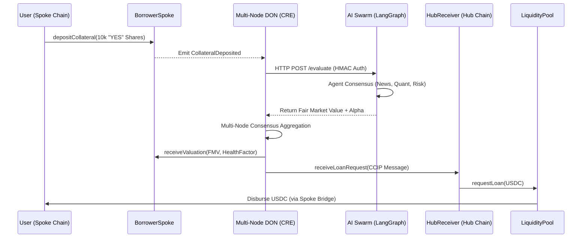
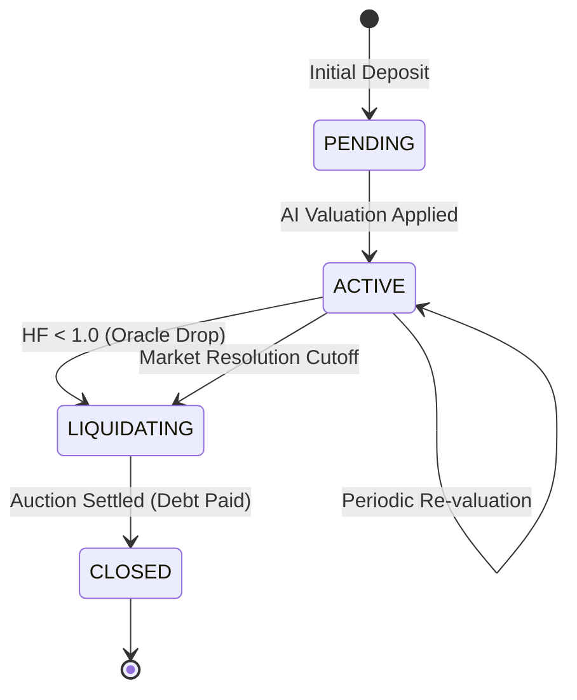
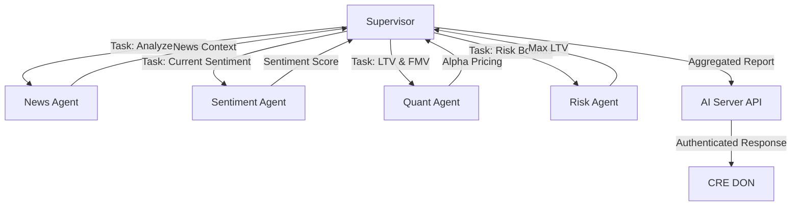
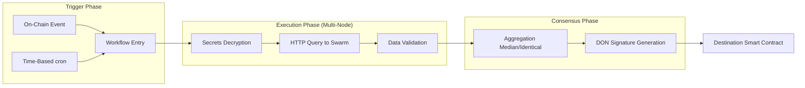

# PBCM Protocol: Technical Architecture Breakdown

The **Prediction Backed Credit Market (PBCM)** is an omnichain (multi chain) lending protocol that allows users to borrow stablecoins against prediction market collateral (ERC-1155). It utilizes a Hub-and-Spoke architecture, secured by **Chainlink CCIP** for cross-chain communication and **Chainlink CRE** for AI-driven collateral valuation.

---

## 1. Deployed Contract Addresses

### A. Local Anvil Testnet (Chain ID: 31337)
| Contract Name | Address |
| :--- | :--- |
| **BorrowerSpoke** | `0xc7143d5ba86553c06f5730c8dc9f8187a621a8d4` |
| **LenderSpoke** | `0xc9952fc93fa9be383ccb39008c786b9f94eac95d` |
| **HubReceiver** | `0x8fc8cfb7f7362e44e472c690a6e025b80e406458` |
| **OmnichainLiquidityPool** | `0x87006e75a5b6be9d1bbf61ac8cd84f05d9140589` |
| **DutchAuction** | `0x359570b3a0437805d0a71457d61ad26a28cac9a2` |
| **Governance** | `0xd6b040736e948621c5b6e0a494473c47a6113ea8` |
| **MockUSDC** | `0x139e1d41943ee15dde4df876f9d0e7f85e26660a` |
| **ACEPolicyManager** | `0x82eda215fa92b45a3a76837c65ab862b6c7564a8` |
| **PredictionToken** | `0xcc4c41415fc68b2fbf70102742a83cde435e0ca7` |

### B. Base Sepolia (HUB Chain ID: 84532)
| Contract Name | Address |
| :--- | :--- |
| **BorrowerSpoke** | `0xe9050534f74b2d1a1e1a5c3157f8d20c764be6dc` |
| **LenderSpoke** | `0x2458db893ccf2da93e3072b46a2d96d7ae9edc97` |
| **HubReceiver** | `0xae00f3c48f657efc2f2d0bb4dc46a4f37d8cc402` |
| **OmnichainLiquidityPool** | `0x303a408ac121f458592d39fff0d2e38471cd3b8b` |
| **DutchAuction** | `0xedb1ef607131870101d56c92e0fae8155b11e4c8` |
| **Governance** | `0x987f9661a0e9e04068fc7703ead0b4f4d13a4019` |
| **MockUSDC** | `0x036CbD53842c5426634e7929541eC2318f3dCF7e` |
| **ACEPolicyManager** | `0xa5bca2bf3703ff6a3e7d3184df553e4d7820dd8f` |
| **PredictionToken** | `0xcc2b36392a42448b5099520ac6e4d43c6259adf2` |

### C. Arbitrum Sepolia (SPOKE Chain ID: 421614)
| Contract Name | Address |
| :--- | :--- |
| **BorrowerSpoke** | `0x987f9661a0e9e04068fc7703ead0b4f4d13a4019` |
| **LenderSpoke** | `0xdb8058f1af2a672ffb7a9444f242929ea3232c8e` |
| **PredictionToken** | `0x0cc8c65d3092d112bc345a7bb7512a8539ee5352` |
| **MockUSDC** | `0x75faf114eafb1BDbe2F0316DF893fd58CE46AA4d` |
| **ACEPolicyManager** | `0xa5bca2bf3703ff6a3e7d3184df553e4d7820dd8f` |

---

## 2. System Architecture

### A. Smart Contracts (The Settlement Layer)
*   **BorrowerSpoke**: Deployed on "Spoke" chains (e.g., Arbitrum/Base Sepolia). Escrows prediction tokens and initiates loan requests.
*   **HubReceiver**: Deployed on the "Hub" chain (e.g., Base/Ethereum Sepolia). Orchestrates cross-chain messages and triggers pool logic.
*   **OmnichainLiquidityPool**: The central vault on the Hub that manages stablecoin liquidity and tracks global debt.
*   **DutchAuction**: A specialized liquidation engine on the Hub that sells liquidated collateral to maintain protocol solvency.
*   **Governance & ACEPolicyManager**: Manages risk parameters (LTV, Liquidation Thresholds) and access control.

### B. Chainlink CRE Workflows (The Computational Layer)
The "brains" of the protocol reside in the **Chainlink Custom Runtime Environment (CRE)**. These workflows bridge off-chain AI data with on-chain state.
*   **Valuation Engine**: Intercepts collateral deposits, fetches AI-driven price discovery, and achieves multi-node consensus before updating the contract.
*   **Health Monitor & Liquidator**: Automated bots that monitor health factors and trigger liquidations without user intervention.
*   **Event Resolver**: Connects to the prediction market outcome sources to settle loans based on the "True" state of the world.

### C. AI Swarm (The Intelligence Layer)
A multi-agent system built with **LangGraph** that provides deep analysis of prediction market assets.
*   **News & Sentiment Agents**: Analyze real-time data to determine the "implied probability" of outcomes.
*   **Quant & Risk Agents**: Calculate the fair market value (FMV) and risk premium for the collateral.
*   **Authentication**: Secured via HMAC signatures to ensure only authorized CRE nodes can query the swarm.

---

## 3. Chainlink Integration Map

| File Path | Chainlink Technology | Integration Purpose |
| :--- | :--- | :--- |
| `contracts/src/BorrowerSpoke.sol` | **CCIP** | Encodes and sends cross-chain `LoanRequest` messages and receives `LoanDisbursement`. |
| `contracts/src/HubReceiver.sol` | **CCIP** | Inherits `CCIPReceiver` to process incoming loan requests and liquidity transfers. |
| `contracts/src/LenderSpoke.sol` | **CCIP** | Transfers stablecoin liquidity from side-chains to the central `OmnichainLiquidityPool` on the Hub. |
| `workflows/src/valuation.ts` | **CRE / DON** | Uses `EVMClient` for log triggers, `HTTPClient` for AI Swarm queries, and `ConsensusAggregation` for result validation. |
| `workflows/src/health-monitor.ts` | **CRE / DON** | Periodically scans `BorrowerSpoke` state to identify unhealthy vaults using automated triggers. |
| `workflows/src/liquidator.ts` | **CRE / DON** | Generates and submits on-chain transactions to trigger liquidations via the `DutchAuction`. |
| `workflows/src/event-resolution.ts` | **CRE / DON** | Resolves prediction market outcomes and settles collateral positions cross-chain. |
| `workflows/secrets.yaml` | **Secrets Management** | Maps local environment variables to logical secret names for secure HMAC authentication. |
| `contracts/src/TokenPool.sol` | **CCIP** | Custom CCIP Token Pool logic for handling protocol-specific token transfers. |
---

## 4. Technical Deep Dives

### A. Omnichain Loan Lifecycle (Sequence)
The lifecycle involves three distinct phases: **Collateral Escrow**, **AI Valuation (CRE)**, and **Multi-Chain Disbursement (CCIP)**.

### B. Liquidation State Machine
Vaults are monitored by the `health-monitor` workflow. If a vault's health factor ($HF$) drops below $1.0$, it enters the liquidation pipeline.

---

## 5. Mathematical Risk Models

### Health Factor ($HF$)
The protocol ensures solvency by maintaining a minimum health factor. A vault is liquidatable if $HF < 1$.
$$HF = \frac{(CollateralValue \times LiquidationThreshold)}{TotalLoanAmount}$$
*Where `LiquidationThreshold` is defined by Governance (e.g., 85%).*

### Dynamic Interest Rates
The Hub utilizes a "Kinked" interest rate model to manage liquidity:
- **Base Rate**: 2%
- **Slope 1**: Up to 80% utilization
- **Slope 2**: Aggressive increase above 80% to incentivize repayments.

---

## 6. CCIP Message Specification
PBCM uses a standardized `CCIPMessageCodec` to ensure type-safety across different execution environments (WASM, EVM, Node).

| Message Type | Payload Structure | Direction |
| :--- | :--- | :--- |
| **LoanRequest** | `(uint256 vaultId, address borrower, uint256 ltv, ...)` | Spoke → Hub |
| **LoanRepayment** | `(uint256 vaultId, uint256 amountRepaid)` | Hub → Spoke |
| **LiquidityTransfer** | `(address token, uint256 amount, uint64 destChain)` | Spoke ↔ Hub |

---

## 7. AI Swarm Architecture (LangGraph)
The **AI Swarm** is a multi-agent intelligence layer that provides the "True Value" of prediction market assets. It uses a **Supervisor** pattern to coordinate specialized agents.

### Agent Roles:
- **News Agent**: Scrapes and summarizes real-world event data (e.g., election polls, sports news).
- **Sentiment Agent**: Analyzes Twitter/X and social trends to quantify market "hype" or "panic".
- **Quant Agent**: Uses a Black-Scholes variation for prediction markets to calculate fair market value.
- **Risk Agent**: Evaluates liquidity depth and volatility to cap the maximum borrowable LTV.

---

## 8. CRE Workflow Execution Flow
Chainlink CRE workflows act as the secure bridge. They execute in a **Trustless Runtime** where every step is validated by multiple nodes.

### Security & Authentication
- **HMAC SHA-256**: Every query to the AI Swarm is signed with a unique HMAC key managed by **Chainlink Secrets**.
- **Execution Guard**: Workflows are restricted to specific contract addresses and function selectors via the `ACEPolicyManager`.
- **WASM Isolation**: The CRE runtime executes workflows in a sandboxed WASM environment, preventing unauthorized system calls.
